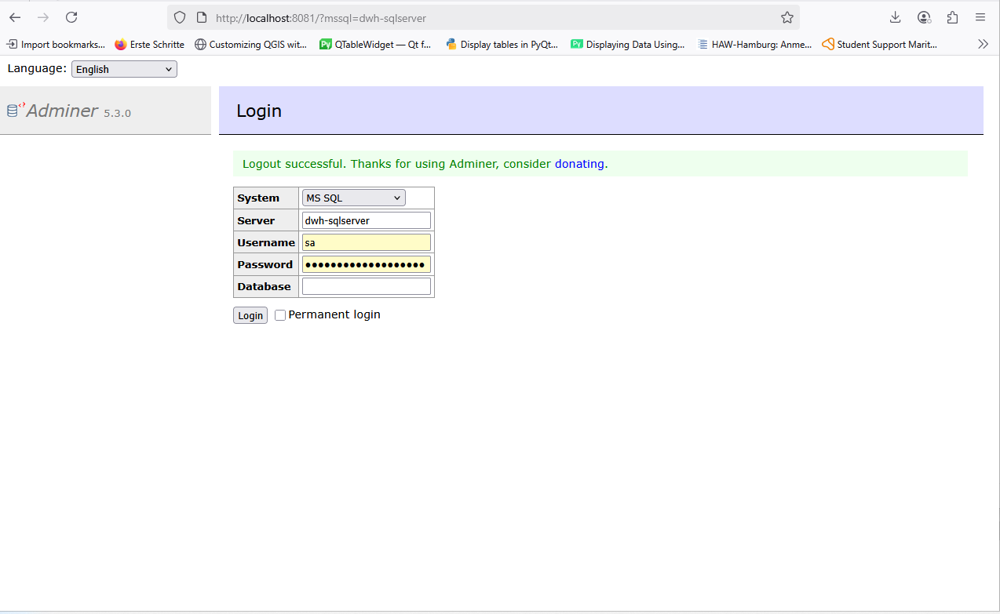

# BI Demo: SQL Server DWH • Python ETL • Power BI • CI

End-to-end mini project that mirrors a typical consulting engagement:
- **ETL** (Python/pandas) loads CSV → `stg.*`
- **DWH** star schema in SQL Server (`dwh.dim_*`, `dwh.fact_sales`)
- **KPI View** `dwh.vw_sales_kpis` for reporting
- **Infra** via Docker + Adminer (SQL GUI)
- **CI** GitHub Actions: spin up SQL Server and run ETL on every push

<p align="center">
  
</p>

---

## 🔧 Tech Stack
- **SQL Server 2022** in Docker
- **Python 3.11+**: pandas, SQLAlchemy, pyodbc, python-dotenv
- **Adminer** for quick SQL admin (browser)
- **Power BI Desktop** (optional dashboard)
- **GitHub Actions** (ODBC 18 on Ubuntu) for CI

---

## ▶️ Quickstart (Windows)

> Prereqs: Docker Desktop running, Python installed (`py -3.13 --version`), ODBC Driver 18 installed (you did this).

```powershell
# From repo root
docker compose -f infra\docker-compose.yml up -d

# (Optional) Create DB once in Adminer: http://localhost:8081
# System: MS SQL | Server: dwh-sqlserver (or localhost:1433) | User: sa | Pwd: <your SA pwd>
# SQL: CREATE DATABASE bi_demo;

# Install Python deps
py -3.13 -m pip install -r etl\requirements.txt

# Load CSVs → stg.*
py -3.13 etl\etl_pipeline.py


Now open Adminer → http://localhost:8081

DB: bi_demo

Run the DWH SQL files in order (no GO needed):

sqlserver/dwh/00_schemas.sql

sqlserver/dwh/10_dim_date.sql

sqlserver/dwh/20_dim_customer.sql

sqlserver/dwh/30_dim_product.sql

sqlserver/dwh/40_fact_sales.sql

sqlserver/dwh/99_views_reporting.sql

---

## ▶️ Quickstart (Windows)


