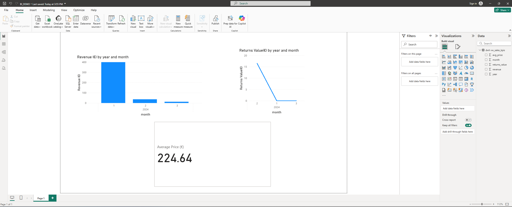
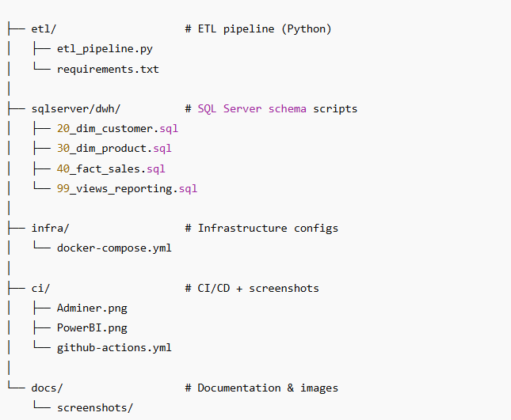

# BI Demo: SQL Server DWH • Python ETL • Power BI • CI/CD

End-to-end mini data project that mirrors a typical consulting engagement:

- **ETL**: Python (pandas) loads CSV → staging tables (`stg.*`)
- **DWH**: Star schema in SQL Server (`dwh.dim_*`, `dwh.fact_sales`)
- **KPI Views**: Business-friendly reporting layer (`dwh.vw_sales_kpis`)
- **Infra**: Docker + Adminer (browser-based SQL GUI)
- **Reporting**: Power BI dashboard (optional)
- **CI/CD**: GitHub Actions automatically spin up SQL Server and run ETL on every push

<p align="center">
  
</p>

---

## 🔧 Tech Stack

- **SQL Server 2022** (in Docker)
- **Python 3.11+**: pandas, SQLAlchemy, pyodbc, python-dotenv
- **Adminer**: lightweight SQL admin GUI (via browser)
- **Power BI Desktop** (optional dashboard visualization)
- **GitHub Actions**: CI/CD with ODBC 18 on Ubuntu

---

## ▶️ Quickstart (Windows)

### Prerequisites
- [Docker Desktop](https://www.docker.com/products/docker-desktop/) running  
- Python installed (`py -3.13 --version`)  
- ODBC Driver 18 for SQL Server installed  

### Setup

```powershell
# From repo root
docker compose -f infra\docker-compose.yml up -d

# (Optional) Create DB once via Adminer
# Open: http://localhost:8081
# System: MS SQL
# Server: dwh-sqlserver (or localhost:1433)
# User: sa
# Pwd: <your SA password>
# Run SQL: CREATE DATABASE bi_demo;

# Install Python dependencies
py -3.13 -m pip install -r etl\requirements.txt

# Run ETL: Load CSVs → staging tables (stg.*)
py -3.13 etl\etl_pipeline.py

```
#### Now open Adminer → http://localhost:8081
<p align="center">
  
</p>

##### SQL Server DWH
Schema Scripts

sqlserver/dwh/20_dim_customer.sql

sqlserver/dwh/30_dim_product.sql

sqlserver/dwh/40_fact_sales.sql

sqlserver/dwh/99_views_reporting.sql

These create a star schema (dimensions + fact table) plus reporting views.
<p align="center">
  
</p>

###### CI/CD with GitHub Actions

The workflow file (ci/github-actions.yml) will:

Spin up SQL Server in Docker on CI agent

Run the Python ETL pipeline

Verify schema + views

This ensures data pipelines + SQL DWH stay in sync on every push.

######Next Steps

Extend ETL to include additional sources

Add Slowly Changing Dimensions (SCD) logic

Enhance Power BI dashboards with more KPIs

Deploy DWH + reporting stack to cloud infra (Azure/AWS/GCP)

